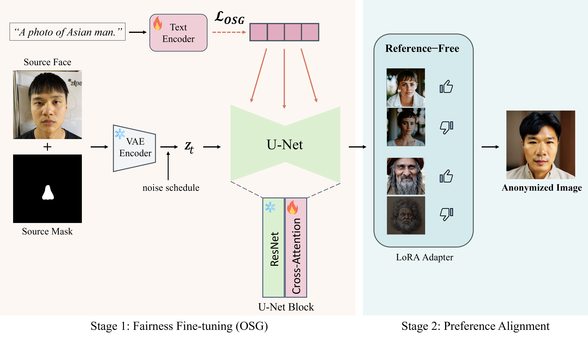

# FairAnon: Demographically Fair Face Anonymization via Orthogonal Semantic Guidance
This repository contains the implementation of **FairAnon**, a demographically fair face anonymization framework using Orthogonal Semantic Guidance (OSG) and Simple Preference Optimization (SimPO).


<be>
 
## 📖 Overview



**FairAnon** addresses the critical challenge of demographic bias in face anonymization systems. Existing generative models exhibit systematic underrepresentation of certain demographic groups, particularly Asians, leading to degraded anonymization quality.

### Key Contributions

- **Orthogonal Semantic Guidance (OSG)**: A novel loss function that restructures the text embedding space by enforcing orthogonality between demographic difference vectors
- **Two-Stage Training Framework**:
  - **Stage 1**: Establishes demographic fairness through OSG while fine-tuning the inpainting model
  - **Stage 2**: Enhances aesthetic quality using Simple Preference Optimization (SimPO) with LoRA adapters
- **Intrinsic Regularization**: OSG provides intrinsic stability, eliminating the need for reference models in preference optimization

## 🚀 Method

### Stage 1: Orthogonal Semantic Guidance
- Enforces orthogonality between demographic difference vectors (Δe_i = TextEncoder(p_i) - TextEncoder(p_base))
- Simultaneously updates text encoder (OSG loss) and U-Net cross-attention layers (diffusion loss)
- Trained on 4,515 Asian facial images from AI Hub

### Stage 2: Simple Preference Optimization
- Applies SimPO with LoRA adapters on the fairness-stabilized model
- Reference-free optimization enabled by OSG's intrinsic regularization
- Trained on Pick-a-Pic preference dataset


## 💡 Model Checkpoints
Check out our models on Hugging Face:

[](https://huggingface.co/dusrb37/FairAnon-OSG)

[](https://huggingface.co/dusrb37/FairAnon-SimPO-LoRA)


## :hammer: Setup

### Environment

```bash
conda create -n FairAnon python=3.10.13
conda activate FairAnon

git clone https://github.com/dusrb37/FairAnon.git
pip install peft
pip install diffusers
pip install -r requirements.txt
```

<be>

## ⬇️: Get the Segmentation Mask

### 1. Pretrained model
1. Download the pretrained model from [Google Drive](https://drive.google.com/file/d/1-0K1gMrjq0C7ssP4UDGePBr8CND4cAJC/view).
2. Download the annotations from  [Google Drive](https://drive.google.com/file/d/1zAEiTPFPky7ilQ1Ou-Kzi9sPVdvx2nnt/view)

3. Put the model under `pretrained` , `annotations` as follows:
    ```
    FairAnon
    └── segmentation
        └── pointrend
            └── model_final.pth
        └── dataset
            └── _annotations.coco
    ```
   

### 2. Segmentation mask

1. Please set the environment by referring to the GitHub link. [Detectron2](https://github.com/facebookresearch/detectron2) , [PointRend](https://github.com/facebookresearch/detectron2/blob/main/projects/PointRend/README.md)

2. Prepare your own images for input:
Place your own images in the input folder. As we trained on patient photos, we do not provide input images.

```bash
python ./segmentation/test_face_segment.py
```
Find the output in `./segmentation/output`

<be>


## :running_man: Train

### 1. Train for the inpainting model


#### **Training with OSG**


```bash
# Train with Orthogonal Semantic Guidance
bash train_fairanon_OSG.sh

# Or run directly:
accelerate launch train_fairanon_OSG.py \
  --model_id "runwayml/stable-diffusion-inpainting" \
  --data_dir "./data/asian_faces" \
  --output_dir "./outputs/fairanon_OSG" \
  --max_train_steps 15000 \
  --lambda_orth 0.1 \
  --lambda_norm 0.01 \
  --epsilon 0.05 \
  --learning_rate 1e-5 \
  --gradient_checkpointing \
  --use_8bit_adam \
  --mixed_precision "fp16" \
```

### **Key Parameters:**

- `--lambda_orth` weight for orthogonality loss
- `--lambda_norm` weight for normalization loss
- `--epsilon` threshold for orthogonality


### 2. Train for SimPO

Run the shell script below for training SimPO. 

```bash
# from ./tarin_diffusion_simpo.sh
export MODEL_NAME="stabilityai/stable-diffusion-2-1"
export DATASET_NAME="yuvalkirstain/pickapic_v2"

accelerate launch train_diffusion_simpo.py \
  --pretrained_model_name_or_path=$MODEL_NAME \
  --dataset_name=$DATASET_NAME \
  --output_dir="./outputs/simpo_lora" \
  --max_train_steps=8000 \
  --beta=200.0 \
  --gamma_beta_ratio=0.5 \
  --rank=4 \
  --learning_rate=1e-5 \
  --mixed_precision="fp16"
```

### **Key Parameters:**

- `--beta` SimPO reward scaling
- `--gamma_beta_ratio` Margin ratio
- `--loss_type` SimPO loss type (sigmoid, hinge, etc.)
- `--rank` LoRA rank


<be>

## ✈️ Inference

To inference, Checkout - `inference.ip` for mode details.
